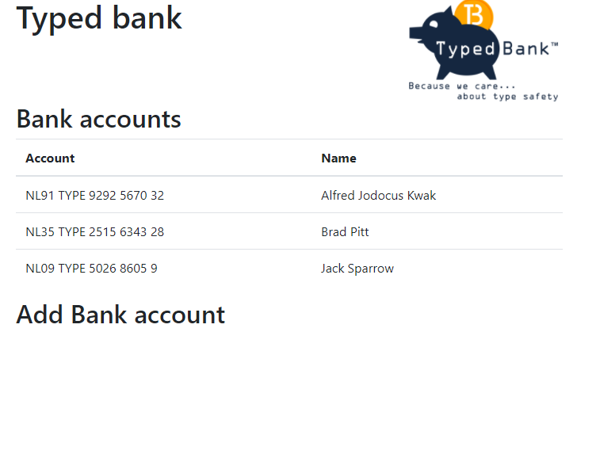
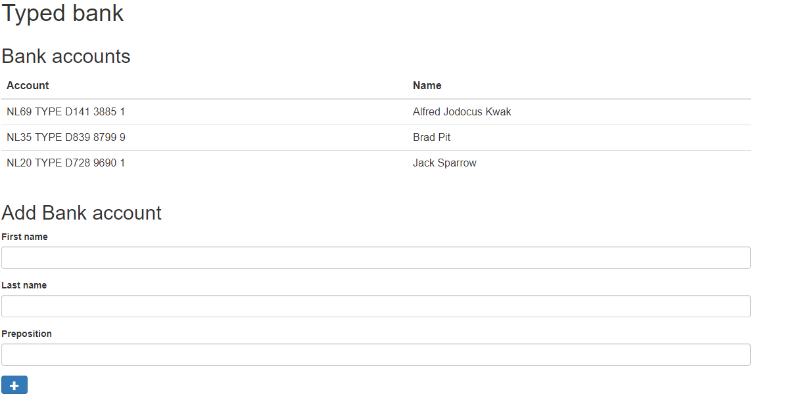

# Lab 14 - Await async calls

If you couldn't finish the previous exercise, you can copy and paste the pervious solution from the _labsSolutions_ directory.

In this lab, we'll change the client to retrieve information from the server and show it on the screen. You can reuse the classes from the 'src/shared' folder so you don't have to recreate the `BankConfig` or `BankAccount` classes.

**Note:** Make sure that typescript compiler is running in watch mode (`npx tsc -b -w`).

## Exercise 1 - Show name of the `BankConfig`

1. In the "client" directory, create a new file "Backend.ts" to hold a new `Backend` class, responsible for http calls to the server.
2. In this new class, create a method `retrieveBank` that will retrieve the `BankConfig` from the server (HTTP GET `/api/bank`). You can use the HTML5's `fetch` API. It returns a `Promise` for all calls:
   ```ts
   fetch('/api/bank').then(
     (response) => response.json() as Promise<BankConfig>
   );
   ```
3. In your 'client.ts' file, use the newly created function to retrieve the name of the current bank and to display it on the screen. You can select the title on the screen with: `document.querySelector('h1')`.
4. Test it out and see that you can actually see the name of the bank.
   - If it doesn't work, be sure to check both consoles for error messages.
   - Don't forget the `.js` when importing. I.e. `import { Backend } from './Backend.js';` instead of `import { Backend } from './Backend';`
5. Now try to replace `promise.then()` calls to `await promise` calls in your `client.ts` and `Backend.ts` files.

## Exercise 2 - Show `BankAccount`s

1. Also create a method for retrieving `BankAccount`s from the server in your `Backend` class. Give it the name `retrieveBankAccounts`.
2. We'll now show our bank accounts inside an HTML table. There is already a _custom element_ prepared for this. Create `src/client/BankAccountsTableComponent.ts` and add copy paste this content:

   ```ts
   import { BankAccount } from '../shared/BankAccount.js';
   export class BankAccountsTableComponent extends HTMLElement {
     private _accounts: BankAccount[] = [];

     public get accounts(): BankAccount[] {
       return this._accounts;
     }

     public set accounts(value: BankAccount[]) {
       this._accounts = value;
       this.updateTable();
     }

     public updateTable() {
       this.innerHTML = `<table class="table">
           <thead>
               <tr>
                   <th>Account</th>
                   <th>Name</th>
               </tr>
           </thead>
           <tbody>
           ${this.accounts
             .map(
               (account) =>
                 `<tr>
                  <td>${account.iban.format()}</td>
                  <td> ${account.customer.format()}</td>
                  </tr>`
             )
             .join('')}
           </tbody>
           </table>`;
     }
   }
   ```

3. Declare the custom element at the top of your `client.ts` file:
   ```ts
   import { BankAccountsTableComponent } from './BankAccountsTableComponent.js';
   customElements.define('bank-accounts-table', BankAccountsTableComponent);
   ```
4. Now bind the bank accounts to the correct element using this code snippet:
   ```ts
   const accounts = await backend.retrieveBankAccounts();
   const bankAccountsTable = document.querySelector(
     'bank-accounts-table'
   ) as BankAccountsTableComponent;
   bankAccountsTable.accounts = accounts;
   ```
5. Run the code and make sure it works. Be sure to check the console for errors if you cannot see the bank accounts on screen. You're free to change the code in order to show the accounts.

If everything went well, it should look like this:




## Exercise 3 (if time permits) - Add new `BackAccounts`

1. Add a new `addCustomer` method to your `Backend` class. It should perform a HTTP POST call to create a new customer on the server. You can use this code snippet.
   ```ts
   await fetch('api/customers', {
     method: 'POST',
     body: JSON.stringify(customer),
     headers: { 'Content-Type': 'application/json' },
   });
   ```
2. We'll create a new "Add customer" form to the page. Again, here is the custom element prepared for the form. Create `src/client/AddCustomerComponent.ts` and copy-paste this content:

   ```ts
   import { Customer } from '../shared/index.js';

   export class AddCustomerComponent extends HTMLElement {
     connectedCallback() {
       this.render();
     }

     private render() {
       this.innerHTML = `<form class="form" name="customer">
        <div class="form-group">
            <label for="nameInput">First name</label>
            <input id="nameInput" name="firstName" type="text" class="form-control">
        </div>
        <div class="form-group">
            <label for="nameInput">Last name</label>
            <input id="nameInput" name="lastName" type="text" class="form-control">
        </div>
        <div class="form-group">
            <label for="nameInput">Preposition</label>
            <input id="nameInput" name="preposition" type="text" class="form-control">
        </div>
        <button type="submit" class="btn btn-primary">Add</button>
    </form>`;
       this.form.addEventListener('submit', (event) => this.submit(event));
     }

     private submit(event: Event) {
       event.preventDefault();
       event.stopPropagation();

       const addCustomerEvent = new CustomEvent('customer-added', {
         detail: new Customer(
           this.form.firstName.value,
           this.form.lastName.value,
           this.form.preposition.value
         ),
       });
       this.dispatchEvent(addCustomerEvent);
     }

     private get form(): HTMLFormElement {
       return this.querySelector('form')!;
     }
   }
   ```

3. Declare the custom element at the top of your `client.ts` file:
   ```ts
   import { AddCustomerComponent } from './AddCustomerComponent.js';
   customElements.define('add-customer', AddCustomerComponent);
   ```
4. Now add a event listener to the `add-customer` element that is responsible for handling the `customer-added` event. You can use this starter code snippet (in "client.ts"):
   ```ts
   document.querySelector('add-customer')?.addEventListener('customer-added', ((
     event: CustomEvent<Customer>
   ) => {
     // TODO, add customer in "event.detail"
   }) as EventListener);
   ```
   Be sure to update the account table after the customer is successfully added.

If everything went well, it should look like this:


